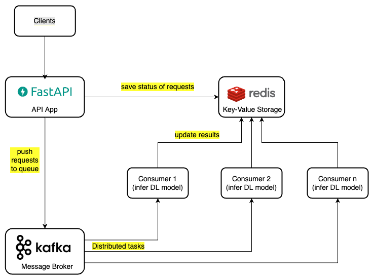
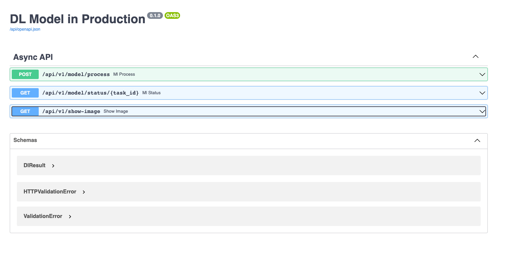

# Serving Deep Learning Models
* Technical stack: FastAPI + Kafka + Redis
* System Diagram:



## Setup
* Prerequisites: Install docker engine (19.03.0+), docker compose (>=1.28.0)
* Run scripts below:
1. Create docker network
```
docker network create dl_network
```
2. Build & run kafka cluster
```
cd kafka

docker compose -f docker-compose.kafka.yml up -d
```
3. Build & run fastAPI app and consumers:
```
cd ..

docker compose -f docker-compose.gpu.yml up -d
```
Run script above if GPUs are available, else:
```
docker compose up -d
```

* Access [http://localhost:8081/api/docs](http://localhost:8081/api/docs) to test APIs:
